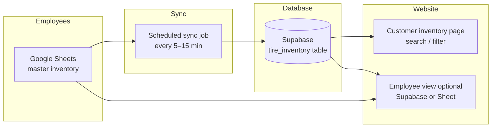

# Live Inventory: Google Sheets → Supabase → Website

> **Current implementation:** the website now uses `public.usedtireinventory`, not
> the proposed `tire_inventory` table shown in this older planning document.
> Follow `docs/google-sheets-sync-setup.md` for the working sync function and
> current column names.

**Goal:** Employees keep updating a Google Sheet. Customers see live stock on the website. Both stay in sync through Supabase (PostgreSQL in the cloud).

**You do NOT need to install PostgreSQL on your computer.**

---

## Recommended architecture



### Why this design?

| Piece | Role |
|-------|------|
| **Google Sheets** | Easy for employees — already in use, no new tool to learn |
| **Supabase** | Fast database for the website, same platform as appointments & login |
| **Sync job** | Copies sheet → database on a schedule (or on demand) |
| **Website** | Reads from Supabase, not directly from Google (more secure & faster) |

**Do not** connect the public website directly to Google Sheets API — that exposes API keys and is slow. Always sync into Supabase first.

---

## Who sees what

| User | Where they work | What they see |
|------|-----------------|---------------|
| **Employees** | Google Sheet (primary) | Full inventory, cost, internal notes, sold items |
| **Employees** (optional) | Supabase dashboard or `/admin/inventory` | Same data after sync, good for debugging |
| **Customers** | `/used-tires` or `/#inventory` on site | Only **published** tires with stock > 0, no internal fields |

---

## Step 1 — Standardize your Google Sheet

Add a header row (row 1) with consistent column names. Example:

| Column | Example | Required | Show on website? |
|--------|---------|:--------:|:----------------:|
| `sku` | UT-225-60-17-001 | Yes | No (internal ID) |
| `brand` | Michelin | Yes | Yes |
| `model` | Defender | No | Yes |
| `size` | 225/60R17 | Yes | Yes |
| `type` | Used / New / Winter | Yes | Yes (filter) |
| `season` | All-season | No | Yes |
| `load_rating` | 99H | No | Yes |
| `price` | 89.99 | Yes | Yes |
| `stock` | 4 | Yes | Yes |
| `condition` | Good | No | Yes |
| `details` | 6/32 tread | No | Yes |
| `status` | published / hidden / sold | Yes | Only `published` |
| `updated_at` | (auto or manual) | No | No |

**Rules for employees:**
- Set `status` = `hidden` or `sold` when a tire should disappear from the site
- Set `stock` = 0 when out of stock
- Only rows with `status` = `published` and `stock` > 0 appear to customers

Share the sheet with the service account or sync script (see Step 3).

---

## Step 2 — Create the Supabase inventory table

Run this in **Supabase → SQL Editor** (in addition to existing appointment tables):

```sql
create table if not exists public.tire_inventory (
  id uuid primary key default gen_random_uuid(),
  sku text unique not null,
  brand text not null,
  model text default '',
  size text not null,
  tire_type text default 'Used',
  season text default '',
  load_rating text default '',
  price numeric(10,2),
  stock integer not null default 0,
  condition text default '',
  details text default '',
  status text not null default 'published',
  sheet_row integer,
  synced_at timestamptz not null default now(),
  created_at timestamptz not null default now(),
  updated_at timestamptz not null default now()
);

create index if not exists tire_inventory_status_stock_idx
  on public.tire_inventory (status, stock);

create index if not exists tire_inventory_size_idx
  on public.tire_inventory (size);

alter table public.tire_inventory enable row level security;

-- Customers: read published in-stock tires only
drop policy if exists "Public can read published inventory" on public.tire_inventory;
create policy "Public can read published inventory"
on public.tire_inventory for select
using (status = 'published' and stock > 0);

-- No public insert/update/delete (sync uses service role key server-side)
```

Save the full version in: `supabase/tire-inventory-schema.sql`

---

## Step 3 — Sync Google Sheets → Supabase

### Option A — Netlify scheduled function (recommended, matches current stack)

1. Create `netlify/functions/sync-inventory-from-sheets.js`
2. Use Google Service Account credentials (stored as Netlify env vars)
3. Read sheet via Google Sheets API
4. Upsert rows into `tire_inventory` using `SUPABASE_SERVICE_ROLE_KEY`
5. Trigger on schedule (Netlify scheduled functions) every **5–15 minutes**

**Netlify env vars to add:**
```env
GOOGLE_SHEETS_ID=your_spreadsheet_id
GOOGLE_SERVICE_ACCOUNT_EMAIL=...
GOOGLE_SERVICE_ACCOUNT_PRIVATE_KEY=...
```

**Pros:** Same hosting as the site, one place for secrets  
**Cons:** Requires Google Cloud service account setup (one-time)

### Option B — Google Apps Script (easier start, no Google Cloud project)

1. In Google Sheets: **Extensions → Apps Script**
2. Script reads all rows and POSTs to a Netlify function or directly to Supabase REST API
3. Run on a **time-driven trigger** (every 5–15 min) or manual button "Sync to website"

**Pros:** Fastest to prototype, lives inside the sheet  
**Cons:** Slightly harder to version-control; keep script copied in repo

### Option C — Manual sync during early testing

1. Export sheet as CSV
2. Run `node scripts/import-inventory-from-csv.js`
3. Good for first demo in the meeting — not for production

**Start with Option C for the meeting, move to A or B for production.**

---

## Step 4 — Show inventory on the website

The repo already has inventory UI logic in `auth.js` + `auth.css` (search, filter, cart). Planned changes:

| Task | Details |
|------|---------|
| Create **`/used-tires.html`** | Inventory search page with `#inventory-list` |
| New **`inventory.js`** | Load from Supabase instead of `assets/inventory.json` |
| Use **Supabase auth** | Same login as appointments (replace Netlify Identity cart path) |
| Update links | Footer, chat, homepage CTAs → `/used-tires` |
| Hide internal fields | Never send cost or internal notes to the browser |

**Customer flow:**
```
Browse /used-tires → search by size/brand → add to cart → login → checkout
```

---

## Step 5 — Keep employees and customers in sync

| Event | Employee action | Customer sees |
|-------|-----------------|---------------|
| New tire added | Add row in sheet, `status=published` | After sync (~5–15 min) |
| Tire sold | Set `stock=0` or `status=sold` | Removed after sync |
| Price change | Edit `price` in sheet | Updated after sync |
| Hold a tire | `status=hidden` | Hidden immediately after sync |

**Optional improvements later:**
- "Sync now" button in Google Sheet for instant update
- Supabase realtime subscription so page updates without refresh
- Low-stock alerts email to employees
- When checkout completes → auto decrement `stock` in Supabase (and optionally write back to sheet)

---

## Step 6 — Employee-only features (phase 2)

| Feature | Tool |
|---------|------|
| View all rows including sold | Google Sheet (already) |
| Audit sync history | Supabase `synced_at` column + Netlify function logs |
| Simple admin page | `/admin/inventory` protected by Supabase employee role |
| Mark sold from website | Admin button → updates Supabase → sync back to sheet |

For employee roles, add to Supabase:
```sql
-- Example: flag employee accounts in customer_profiles
alter table public.customer_profiles
  add column if not exists role text default 'customer';
-- role = 'employee' | 'admin' | 'customer'
```

---

## What you need before building

Checklist to bring to the meeting or send the developer:

- [ ] Link or copy of Google Sheet with **column headers**
- [ ] Sample rows (3–5 tires, can be anonymized)
- [ ] Confirm which columns are **public vs internal**
- [ ] Supabase project access (same project as appointments)
- [ ] Decision: sync every 5 min, 15 min, or manual at first?
- [ ] Decision: online checkout for tires now, or "call to reserve" first?

---

## Phased rollout

### Phase 1 — Demo (1 week)
- Standardize sheet columns
- Create Supabase `tire_inventory` table
- Manual CSV import script
- Basic `/used-tires` page reading Supabase

### Phase 2 — Live sync (1–2 weeks)
- Google Sheets → Supabase automated sync
- Update homepage/footer/chat links
- Test with employees updating sheet

### Phase 3 — Sales (2–4 weeks)
- Cart + checkout for tires (reuse Stripe + Supabase auth)
- Auto-reduce stock on purchase
- Employee notifications when stock is low

---

## FAQ

**Do I download PostgreSQL?**  
No. Use Supabase in the browser.

**Can employees keep using Google Sheets?**  
Yes. That should stay the main daily tool.

**Will customers see changes instantly?**  
After each sync (5–15 min by default). Can be faster with manual sync or realtime later.

**What if someone buys on the phone while a customer is browsing?**  
Employee sets stock to 0 in sheet → disappears on next sync. For high traffic, add checkout reservation logic in Phase 3.

---

## Related files in this repo

- `auth.js` — existing inventory UI logic (to migrate to Supabase)
- `auth.css` — inventory page styles
- `supabase/appointment-automation-schema.sql` — existing DB schema
- `docs/appointment-automation-setup.md` — Supabase + Netlify env setup

---

## Meeting talking point

> "We keep Google Sheets as the employee system. A sync job copies inventory into Supabase every few minutes. The website reads from Supabase so customers always see published, in-stock tires — without exposing our sheet or slowing down the site."
